**source_file:**

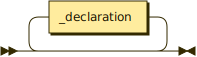

```
source_file
         ::= _declaration*
```

**_declaration:**


```
_declaration
         ::= import_declaration
           | module_declaration
           | typealias_declaration
           | const_declaration
           | trait_declaration
           | struct_declaration
           | enum_declaration
           | _impl_declaration
           | function_declaration
```

referenced by:

* impl_body
* module_body
* source_file

**path:**


```
path     ::= name ( '::' name )* '::'?
```

referenced by:

* attribute_argument
* attribute_value
* import_declaration

**module_declaration:**

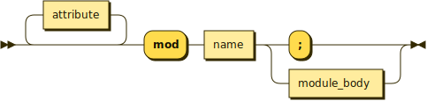

```
module_declaration
         ::= attribute* 'mod' name ( ';' | module_body )
```

referenced by:

* _declaration

**module_body:**


```
module_body
         ::= '{' _declaration* '}'
```

referenced by:

* module_declaration

**import_declaration:**

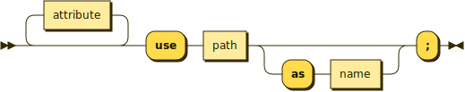

```
import_declaration
         ::= attribute* 'use' path ( 'as' name )? ';'
```

referenced by:

* _declaration

**const_declaration:**

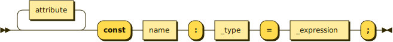

```
const_declaration
         ::= attribute* 'const' name ':' _type '=' _expression ';'
```

referenced by:

* _declaration

**typealias_declaration:**


```
typealias_declaration
         ::= attribute* 'type' name type_parameters? '=' _type ';'
```

referenced by:

* _declaration

**trait_declaration:**


```
trait_declaration
         ::= attribute* 'trait' name type_parameters? trait_body
```

referenced by:

* _declaration

**trait_body:**

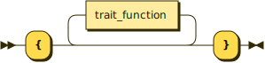

```
trait_body
         ::= '{' trait_function* '}'
```

referenced by:

* trait_declaration

**trait_function:**

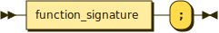

```
trait_function
         ::= function_signature ';'
```

referenced by:

* trait_body

**struct_declaration:**

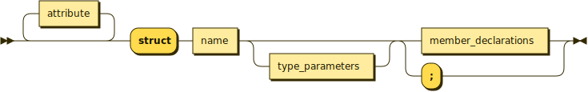

```
struct_declaration
         ::= attribute* 'struct' name type_parameters? ( member_declarations | ';' )
```

referenced by:

* _declaration

**enum_declaration:**


```
enum_declaration
         ::= attribute* 'enum' name type_parameters? member_declarations
```

referenced by:

* _declaration

**member_declarations:**


```
member_declarations
         ::= '{' ( member_declaration ',' )* member_declaration? '}'
```

referenced by:

* enum_declaration
* struct_declaration

**member_declaration:**

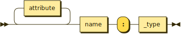

```
member_declaration
         ::= attribute* name ':' _type
```

referenced by:

* member_declarations

**_impl_declaration:**

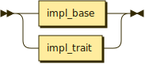

```
_impl_declaration
         ::= impl_base
           | impl_trait
```

referenced by:

* _declaration

**impl_base:**

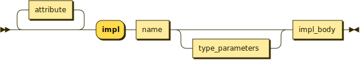

```
impl_base
         ::= attribute* 'impl' name type_parameters? impl_body
```

referenced by:

* _impl_declaration

**impl_trait:**


```
impl_trait
         ::= attribute* 'impl' name type_parameters? 'of' qualified_name impl_body
```

referenced by:

* _impl_declaration

**impl_body:**


```
impl_body
         ::= '{' _declaration* '}'
```

referenced by:

* impl_base
* impl_trait

**function_declaration:**

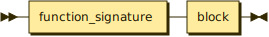

```
function_declaration
         ::= function_signature block
```

referenced by:

* _declaration

**function_signature:**

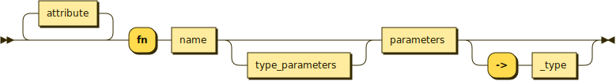

```
function_signature
         ::= attribute* 'fn' name type_parameters? parameters ( '->' _type )?
```

referenced by:

* function_declaration
* trait_function

**parameters:**


```
parameters
         ::= '(' ( parameter ',' )* parameter? ')'
```

referenced by:

* function_signature

**parameter:**

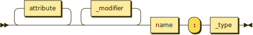

```
parameter
         ::= attribute* _modifier* name ':' _type
```

referenced by:

* parameters

**type_parameters:**

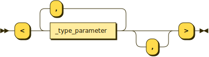

```
type_parameters
         ::= '<' _type_parameter ( ',' _type_parameter )* ','? '>'
```

referenced by:

* enum_declaration
* function_signature
* impl_base
* impl_trait
* struct_declaration
* trait_declaration
* typealias_declaration

**_type_parameter:**

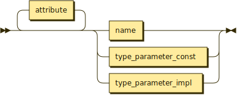

```
_type_parameter
         ::= attribute* ( name | type_parameter_const | type_parameter_impl )
```

referenced by:

* type_parameters

**type_parameter_const:**

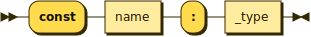

```
type_parameter_const
         ::= 'const' name ':' _type
```

referenced by:

* _type_parameter

**type_parameter_impl:**


```
type_parameter_impl
         ::= 'impl' name ':' _type
```

referenced by:

* _type_parameter

**block:**

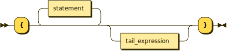

```
block    ::= '{' statement* tail_expression? '}'
```

referenced by:

* _expression
* function_declaration
* if_expression
* loop_expression

**tail_expression:**


```
tail_expression
         ::= attribute* _expression
```

referenced by:

* block

**statement:**

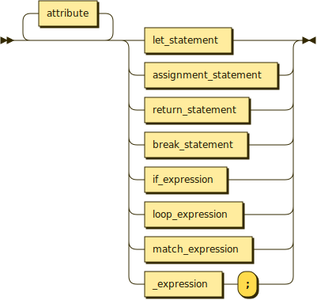

```
statement
         ::= attribute* ( let_statement | assignment_statement | return_statement | break_statement | if_expression | loop_expression | match_expression | _expression ';' )
```

referenced by:

* block

**let_statement:**


```
let_statement
         ::= 'let' 'mut'? _pattern ( ':' _type )? '=' _expression ';'
```

referenced by:

* statement

**assignment_statement:**

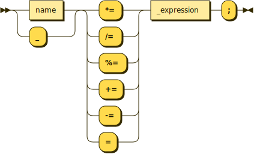

```
assignment_statement
         ::= ( name | '_' ) ( '*=' | '/=' | '%=' | '+=' | '-=' | '=' ) _expression ';'
```

referenced by:

* statement

**return_statement:**


```
return_statement
         ::= 'return' _expression? ';'
```

referenced by:

* statement

**break_statement:**


```
break_statement
         ::= 'break' _expression? ';'
```

referenced by:

* statement

**_expression:**


```
_expression
         ::= tuple_expressions
           | block
           | unary_expression
           | binary_expression
           | if_expression
           | loop_expression
           | match_expression
           | selector_expression
           | index_expression
           | call_expression
           | qualified_name
           | _literal_expression
```

referenced by:

* argument
* assignment_statement
* binary_expression
* break_statement
* call_expression
* const_declaration
* index_expression
* let_statement
* match_case
* match_expression
* named_argument
* return_statement
* selector_expression
* statement
* tail_expression
* tuple_expression
* unary_expression

**_simple_expression:**


```
_simple_expression
         ::= tuple_expressions
           | unary_expression
           | binary_expression
           | if_expression
           | loop_expression
           | match_expression
           | selector_expression
           | index_expression
           | call_expression
           | qualified_name
           | _literal_expression
```

referenced by:

* if_expression

**unary_expression:**

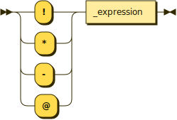

```
unary_expression
         ::= ( '!' | '*' | '-' | '@' ) _expression
```

referenced by:

* _expression
* _simple_expression

**binary_expression:**

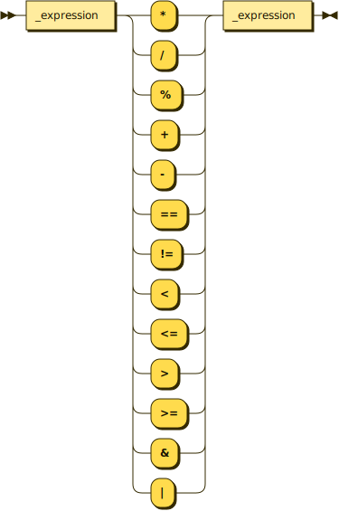

```
binary_expression
         ::= _expression ( '*' | '/' | '%' | '+' | '-' | '==' | '!=' | '<' | '<=' | '>' | '>=' | '&' | '|'
                  ) _expression
```

referenced by:

* _expression
* _simple_expression

**tuple_expressions:**


```
tuple_expressions
         ::= '(' tuple_expression ( ',' tuple_expression )* ','? ')'
```

referenced by:

* _expression
* _simple_expression

**tuple_expression:**

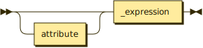

```
tuple_expression
         ::= attribute? _expression
```

referenced by:

* tuple_expressions

**if_expression:**


```
if_expression
         ::= 'if' _simple_expression block ( 'else' 'if' _simple_expression block )* ( 'else' block )?
```

referenced by:

* _expression
* _simple_expression
* statement

**loop_expression:**


```
loop_expression
         ::= 'loop' block
```

referenced by:

* _expression
* _simple_expression
* statement

**match_expression:**


```
match_expression
         ::= 'match' _expression match_cases
```

referenced by:

* _expression
* _simple_expression
* statement

**match_cases:**

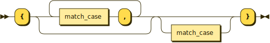

```
match_cases
         ::= '{' ( match_case ',' )* match_case? '}'
```

referenced by:

* match_expression

**match_case:**


```
match_case
         ::= attribute* _match_case_pattern '=>' _expression
```

referenced by:

* match_cases

**_match_case_pattern:**


```
_match_case_pattern
         ::= _pattern
           | _literal_expression
```

referenced by:

* match_case

**call_expression:**

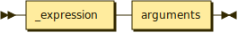

```
call_expression
         ::= _expression arguments
```

referenced by:

* _expression
* _simple_expression

**arguments:**

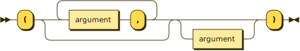

```
arguments
         ::= '(' ( argument ',' )* argument? ')'
```

referenced by:

* call_expression

**argument:**

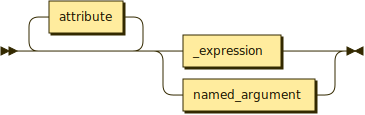

```
argument ::= attribute* ( _expression | named_argument )
```

referenced by:

* arguments

**named_argument:**

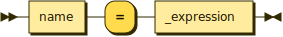

```
named_argument
         ::= name '=' _expression
```

referenced by:

* argument

**selector_expression:**

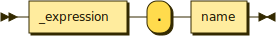

```
selector_expression
         ::= _expression '.' name
```

referenced by:

* _expression
* _simple_expression

**index_expression:**


```
index_expression
         ::= _expression '[' _expression ']'
```

referenced by:

* _expression
* _simple_expression

**_literal_expression:**


```
_literal_expression
         ::= 'true'
           | 'false'
           | number
           | string
           | unit
```

referenced by:

* _expression
* _match_case_pattern
* _simple_expression
* attribute_argument
* type_argument

**attribute:**


```
attribute
         ::= '#' '[' attribute_value+ ']'
```

referenced by:

* _type_parameter
* argument
* const_declaration
* enum_declaration
* function_signature
* impl_base
* impl_trait
* import_declaration
* match_case
* member_declaration
* module_declaration
* parameter
* statement
* struct_declaration
* tail_expression
* trait_declaration
* tuple_expression
* type_argument
* typealias_declaration

**attribute_value:**

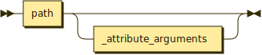

```
attribute_value
         ::= path _attribute_arguments?
```

referenced by:

* attribute

**_attribute_arguments:**


```
_attribute_arguments
         ::= '(' attribute_argument ( ',' attribute_argument )* ','? ')'
```

referenced by:

* attribute_argument
* attribute_value

**attribute_argument:**


```
attribute_argument
         ::= name
           | _literal_expression
           | path ':' ( _literal_expression | _attribute_arguments )
```

referenced by:

* _attribute_arguments

**_modifier:**

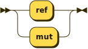

```
_modifier
         ::= 'ref'
           | 'mut'
```

referenced by:

* parameter

**name:**

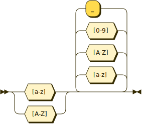

```
name     ::= [a-zA-Z] [a-zA-Z0-9_]*
```

referenced by:

* _pattern_struct_binding
* _pattern_var
* _type_parameter
* assignment_statement
* attribute_argument
* const_declaration
* enum_declaration
* function_signature
* impl_base
* impl_trait
* import_declaration
* member_declaration
* module_declaration
* named_argument
* parameter
* path
* qualified_name
* qualified_name_segment
* selector_expression
* struct_declaration
* trait_declaration
* type_parameter_const
* type_parameter_impl
* typealias_declaration

**qualified_name:**


```
qualified_name
         ::= ( qualified_name_segment '::' )* name ( '::' type_arguments )?
```

referenced by:

* _expression
* _simple_expression
* impl_trait
* pattern_enum
* pattern_struct
* type_argument
* type_identifier

**qualified_name_segment:**

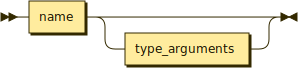

```
qualified_name_segment
         ::= name type_arguments?
```

referenced by:

* qualified_name

**_type:**

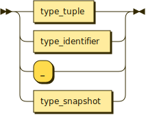

```
_type    ::= type_tuple
           | type_identifier
           | '_'
           | type_snapshot
```

referenced by:

* const_declaration
* function_signature
* let_statement
* member_declaration
* parameter
* type_parameter_const
* type_parameter_impl
* type_snapshot
* type_tuple
* typealias_declaration

**type_tuple:**


```
type_tuple
         ::= '(' ( _type ',' )* _type? ')'
```

referenced by:

* _type

**type_snapshot:**

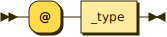

```
type_snapshot
         ::= '@' _type
```

referenced by:

* _type

**type_identifier:**

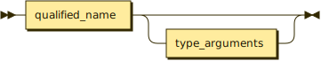

```
type_identifier
         ::= qualified_name type_arguments?
```

referenced by:

* _type

**type_arguments:**

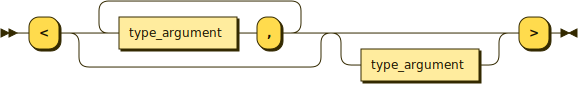

```
type_arguments
         ::= '<' ( type_argument ',' )* type_argument? '>'
```

referenced by:

* qualified_name
* qualified_name_segment
* type_identifier

**type_argument:**

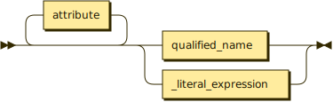

```
type_argument
         ::= attribute* ( qualified_name | _literal_expression )
```

referenced by:

* type_arguments

**_pattern:**


```
_pattern ::= _pattern_var
           | pattern_struct
           | pattern_enum
           | pattern_tuple
```

referenced by:

* _match_case_pattern
* _pattern_struct_binding
* let_statement
* pattern_enum
* pattern_tuple

**_pattern_var:**


```
_pattern_var
         ::= '_'
           | name
```

referenced by:

* _pattern

**pattern_struct:**

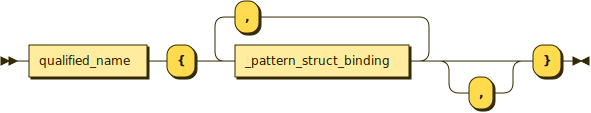

```
pattern_struct
         ::= qualified_name '{' _pattern_struct_binding ( ',' _pattern_struct_binding )* ','? '}'
```

referenced by:

* _pattern

**_pattern_struct_binding:**

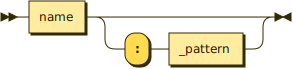

```
_pattern_struct_binding
         ::= name ( ':' _pattern )?
```

referenced by:

* pattern_struct

**pattern_enum:**


```
pattern_enum
         ::= qualified_name '(' _pattern ( ',' _pattern )* ','? ')'
```

referenced by:

* _pattern

**pattern_tuple:**

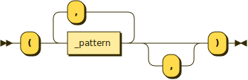

```
pattern_tuple
         ::= '(' _pattern ( ',' _pattern )* ','? ')'
```

referenced by:

* _pattern

**number:**


```
number   ::= ( integer | hex | octal | binary ) _number_suffix?
```

referenced by:

* _literal_expression

**unit:**

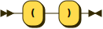

```
unit     ::= '(' ')'
```

referenced by:

* _literal_expression

**integer:**

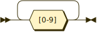

```
integer  ::= [0-9]+
```

referenced by:

* number

**hex:**


```
hex      ::= '0x' [0-9a-f]+
```

referenced by:

* number

**octal:**

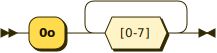

```
octal    ::= '0o' [0-7]+
```

referenced by:

* number

**binary:**

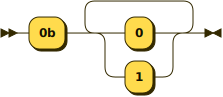

```
binary   ::= '0b' [0-1]+
```

referenced by:

* number

**_number_suffix:**

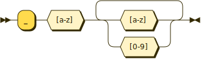

```
_number_suffix
         ::= '_' [a-z] [a-z0-9]+
```

referenced by:

* number

**string:**

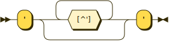

```
string   ::= "'" [^']* "'"
```

referenced by:

* _literal_expression

**comment:**


```
comment  ::= '//' '.'* '\n'
```

## 
 <sup>generated by [RR - Railroad Diagram Generator][RR]</sup>

[RR]: http://bottlecaps.de/rr/ui